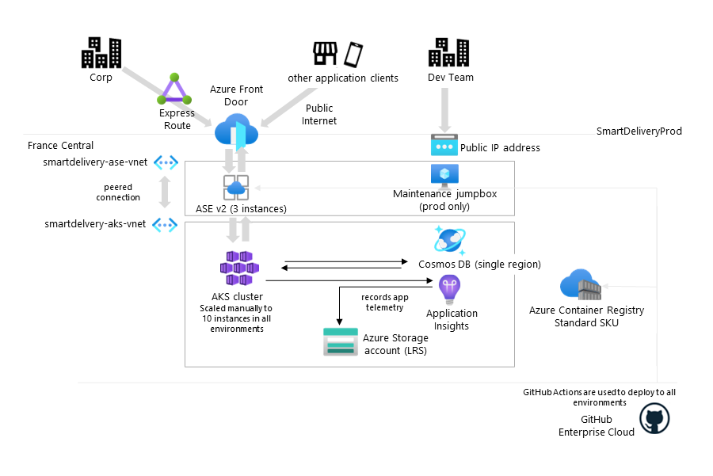

# Architecting for Success

---

## 105 - Azure Well Architected Workshop

---

## Customer scenario: Adatum Deliveries (PaaS)

### Part 1: Current state

Business model, geography, and size
* Logistics company providing next-day delivery services across the European Union
* The company is subject to the General Data Protection Regulation (GDPR)
* Headquartered in Paris, France
* Manages an international fleet of planes, trains, and delivery vehicles

Technology landscape
* An on-premises datacenter (headquarters)
* A custom Azure-hosted delivery platform (SmartDelivery)
* Provides services to schedule, track, and fulfill deliveries
* Serves as a backend for client apps (mobile and browser-based)

Business continuity and disaster recovery (BCDR)
* No existing disaster recovery plans

Operational model
* Centralized, following the enterprise operations approach
* SmartDelivery is an exception, managed by an autonomous development team
* Includes a newly formed Cloud Center of Excellence (CCoE) team

Cloud security model
* Relies primarily on network isolation

Internal IT knowledge and experience
* Expert knowledge of on-premises workloads
* Some experience with Azure PaaS
* Gaps in knowledge of Azure-based containerized workloads
* Gaps in development of cloud-native apps
* Little experience with Azure
* Familiarity with DevOps using GitHub Enterprise and Bicep

---

### Part 2: Current workload

SmartDelivery
* The first and so far only cloud native app onboarded to Azure
* Owned by the dedicated SmartDelivery development team
  * Affected recently by a platform outage of Cosmos DB
  * Led to negative publicity and reputational damage
  * Designed and deployed as a set of APIs
  * Container-based backend
  * Web API-based front end
  * Majority of API calls are synchronous

Current workload architecture
* Microservices-based
* Containerized backend APIs hosted on an Azure Kubernetes Service (AKS) cluster
  * A single agent pool manually scaled to ten instances
  * Container images stored in an Azure Container Registry (ACR)
* Web APIs for client access deployed in an App Service Environment (ASE)
* Delivery data in a Cosmos DB account configured with locally redundant backups

Environments
* A single-region deployment (France Central)
* Isolation between production, staging, and development
* Each environment uses a matching set of compute and storage resources

Current workload networking
* An ASE deployment
  * Accessible via Azure Front Door
    * ExpressRoute connection from headquarters
    * A public endpoint from Internet-based clients
* An AKS cluster
  * Accessible via a single, public-facing jumpbox Azure VM by the SmartDelivery team
  * Accessible from the ASE deployment via virtual network peering
* A Cosmos DB account
  * Accessible via private endpoint only (not exposed to public internet) from AKS
* An Azure Storage account
  * Accessible via private endpoint only (not exposed to public internet)
* An ACR instance
  * Accessible via a public endpoint

Current workload DevOps status
* Development and staging environments
  * Configured identically to the production environment but not exposed to the public internet via Azure Front Door
  * Separated physically (separate AKS clusters/ASEs) and logically (application-based)
* CI/CD pipelines hosted in GitHub Enterprise
  * Automated by using GitHub Actions and Bicep templates
* AKS telemetry
  * Collected by using Azure Application Insights
  * Stored in an Azure Storage account
  * Exported to a third-party security information and event management (SIEM) system
* AKS configuration and troubleshooting
  * Performed on as-needed basis from the jumpbox Azure VM by the SmartDelivery team (using local credentials)

---

### Part 3: Customer needs

* Recommend a solution that minimizes the impact of regional Cosmos DB outages
* Enhance the current architectural design to provide 99.95% availability service-level agreement (SLA)
* Recommend a BCDR strategy that provides recovery point objective (RPO) of six hours and recovery time objective (RTO) of four hours
* Minimize cost while maintaining the desired SLA, RPO, and RTO, and network isolation, including alternatives for hosting client access APIs (in lieu of ASE)
* Ensure GDPR compliance and retain all customer data within the EU boundaries
* Replace synchronous processing with an event-driven, asynchronous approach
* Identify methods of protecting against AKS pod-level escalation of privileges
* Ensure network isolation whenever feasible, including microservices and client access APIs, ACR (The SmartDelivery team attempted to implement an ACR private endpoint but had to revert the change due to subsequent failures of GitHub Enterprise deployments) and AKS
* Leverage Azure-native solutions whenever feasible
* Minimize operational overhead

---

### Part 4: Customer objections

* The Adatum's Finance department is concerned that implementing a solution providing 99.95% availability SLA will practically double the current cost. They will not approve such a steep increase in budget.
* The Adatum's CIO considers the 99.95% availability SLA essential to redeeming the company's reputation and will object to any solution that does not meet this goal.
* The SmartDelivery development team will object to any solution that would complicate or slow down their existing automated deployment process.
* The CCoE team expects a solution that would facilitate deployment of additional cloud-native workloads like SmartDelivery and will not accept any solution that does not promote repeatability.
