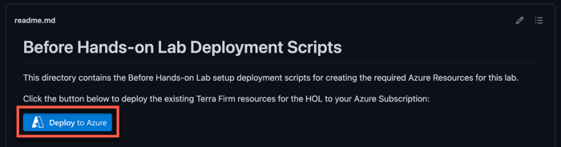
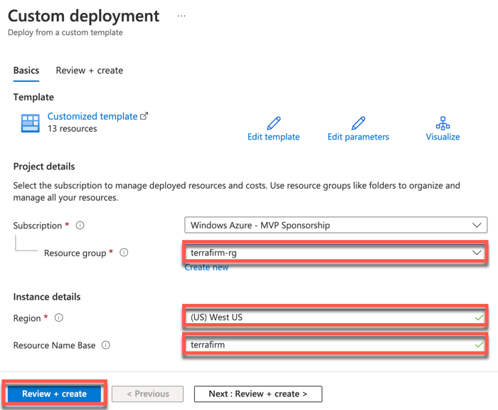
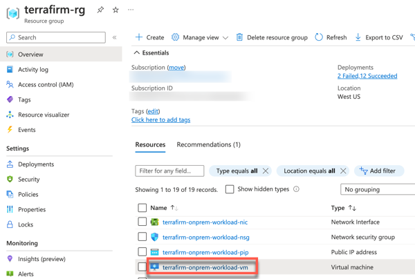
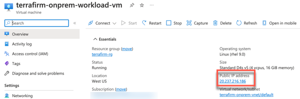
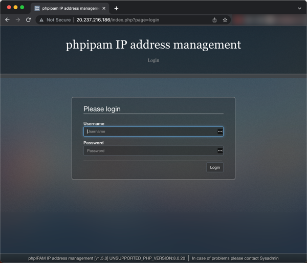

<div class="MCWHeader1">
Building the business migration case with Linux and OSS DB to Azure
</div>

<div class="MCWHeader2">
Before the hands-on lab setup guide
</div>

<div class="MCWHeader3">
December 2022
</div>

Information in this document, including URL and other Internet Web site references, is subject to change without notice. Unless otherwise noted, the example companies, organizations, products, domain names, e-mail addresses, logos, people, places, and events depicted herein are fictitious, and no association with any real company, organization, product, domain name, e-mail address, logo, person, place or event is intended or should be inferred. Complying with all applicable copyright laws is the responsibility of the user. Without limiting the rights under copyright, no part of this document may be reproduced, stored in or introduced into a retrieval system, or transmitted in any form or by any means (electronic, mechanical, photocopying, recording, or otherwise), or for any purpose, without the express written permission of Microsoft Corporation.

Microsoft may have patents, patent applications, trademarks, copyrights, or other intellectual property rights covering subject matter in this document. Except as expressly provided in any written license agreement from Microsoft, the furnishing of this document does not give you any license to these patents, trademarks, copyrights, or other intellectual property.

The names of manufacturers, products, or URLs are provided for informational purposes only and Microsoft makes no representations and warranties, either expressed, implied, or statutory, regarding these manufacturers or the use of the products with any Microsoft technologies. The inclusion of a manufacturer or product does not imply endorsement of Microsoft of the manufacturer or product. Links may be provided to third party sites. Such sites are not under the control of Microsoft and Microsoft is not responsible for the contents of any linked site or any link contained in a linked site, or any changes or updates to such sites. Microsoft is not responsible for webcasting or any other form of transmission received from any linked site. Microsoft is providing these links to you only as a convenience, and the inclusion of any link does not imply endorsement of Microsoft of the site or the products contained therein.

© 2022 Microsoft Corporation. All rights reserved.

Microsoft and the trademarks listed at <https://www.microsoft.com/en-us/legal/intellectualproperty/Trademarks/Usage/General.aspx> are trademarks of the Microsoft group of companies. All other trademarks are property of their respective owners.

**Contents**

<!-- TOC -->

- [Building the business migration case with Linux and OSS DB to Azure before the hands-on lab setup guide](#building-the-business-migration-case-with-linux-and-oss-db-to-azure-before-the-hands-on-lab-setup-guide)
    - [Requirements](#requirements)
    - [Before the hands-on lab](#before-the-hands-on-lab)
        - [Task 1: Create existing resources](#task-1-create-existing-resources)
        - [Task 2: Verify on-premises web application](#task-2-verify-on-premises-web-application)

<!-- /TOC -->

# Building the business migration case with Linux and OSS DB to Azure before the hands-on lab setup guide

## Requirements

- You must have a working Azure subscription to carry out this hands-on lab step-by-step.

## Before the hands-on lab

Duration: 30 minutes

### Task 1: Create existing resources

In this task, you will leverage a custom Azure Resource Manager (ARM) template to deploy the existing Azure resources and a simulated on-premises environment for Terra Firm.

1. Open a browser using "InPrivate" or "Incognito" mode, and navigate to the ARM template: [ARM Template on GitHub](https://github.com/microsoft/MCW-Building-the-business-migration-case-with-Linux-and-OSS-DB-to-Azure/tree/main/Hands-on%20lab/resources/deployment).

2. Select **Deploy to Azure**. This will open a new browser tab to the Azure Portal for custom deployments.

    

3. If prompted, sign in with an account that is an owner of the Azure Subscription.

4. Fill in the required ARM template parameters.
    - Create a new **Resource group**.
    - Select a **Region**
    - Specify a **Resource Name Base** (specify a base value that includes your initials to keep unique to prevent naming conflicts, for example, `terrafirmcp`).
    - Select **Review + create**

    

5. Agree to the Terms and conditions and select **Create**.

    The deployment is now underway. On average, this process can take 30 minutes to complete. It is important that you monitor the deployment progress to ensure there are no problems. You can monitor progress by selecting the notification bell in the upper right corner and selecting **Deployment in progress...**

    >**Note**: While automation can make things simpler and repeatable, sometimes it can fail. If at any time during the ARM template deployment there is a failure, review the failure, delete the Resource Group, and try the ARM template again. Review the failures and adjust for errors as appropriate.

    Once the ARM template is deployed, the status will change to complete.

   **Note**: Verify deployment success of each resource.  Transient errors are possible and can cause problems later in the hands on lab.

### Task 2: Verify on-premises web application

In this task, you will configure the web application hosted on the simulated on-premises virtual machine that was provisioned by the ARM Template deployment.

1. In the **Azure Portal**, navigate to the **Resource Group** that you created for this lab, then select the **On-premises Workload VM** named similar to `terrafirm-onprem-workload-vm`.

    

2. On the **Virtual Machine** blade, locate and copy the **Public IP Address** for the VM.

    

3. Open a new browser window, then navigate to the following `http://` URL to access the simulated on-premises web application provisioned for this lab. Be sure to replace the `<ip-address>` placeholder with the **Public IP Address** for the VM.

    ```text
    http://<ip-address>
    ```

    > **Note**: If you get an error loading the web application, instead of a login page, then there was an error in provisioning. The easiest workaround is to delete the resource group and run the template deployment again.

4. When the web application loads, you may enter the following credentials to login.

    - **Username**: `Admin`
    - **Password**: `ipamadmin`

    

    > **Note**: The first time you login to the web application, it will prompt you to change the Admin password. A recommended password to change it to is `demo!pass123` so it's easily remembered for the lab.

At this point, things are ready for you to go through the Hands-on lab.

You should follow all steps provided *before* performing the Hands-on lab.
