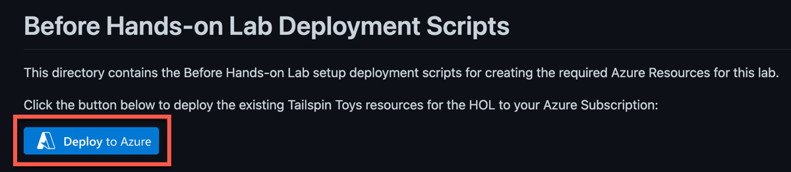
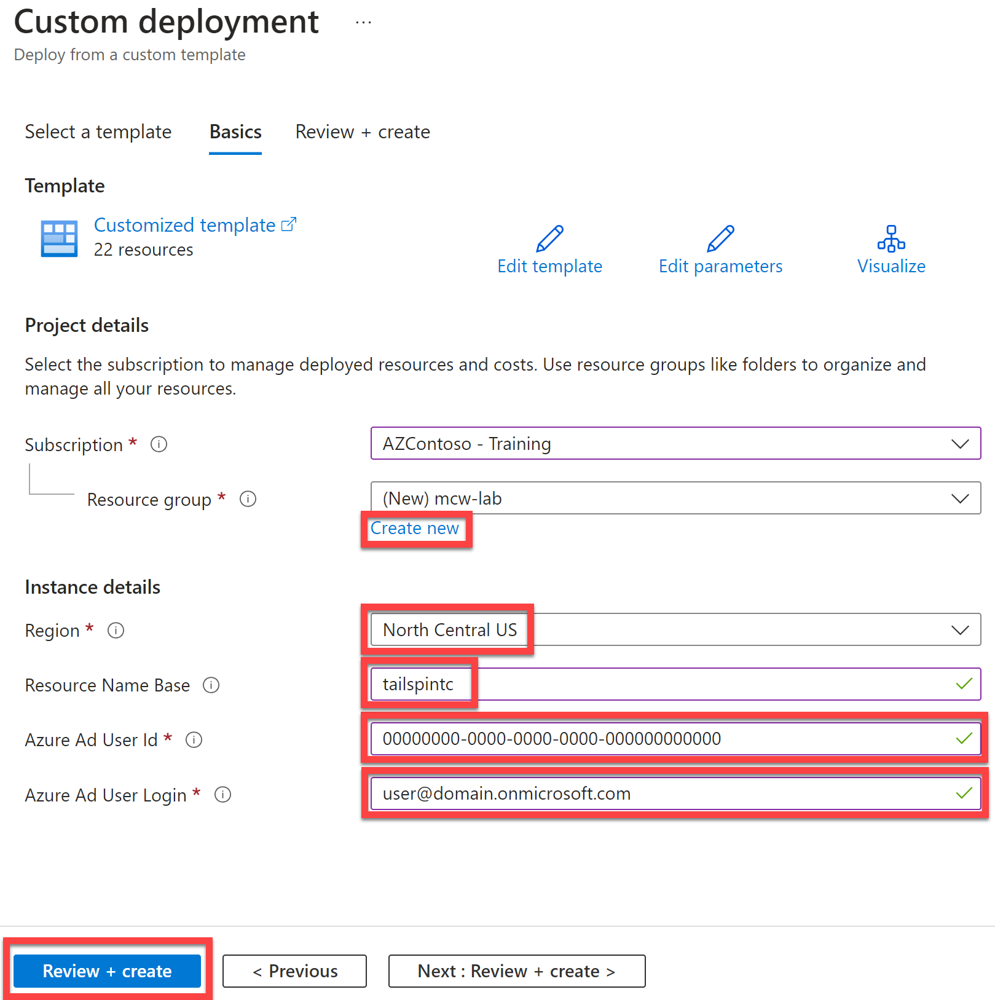

<div class="MCWHeader1">
Building the business migration case with Windows Server and SQL Server
</div>

<div class="MCWHeader2">
Before the hands-on lab setup guide
</div>

<div class="MCWHeader3">
June 2023
</div>


Information in this document, including URL and other Internet Web site references, is subject to change without notice. Unless otherwise noted, the example companies, organizations, products, domain names, e-mail addresses, logos, people, places, and events depicted herein are fictitious, and no association with any real company, organization, product, domain name, e-mail address, logo, person, place or event is intended or should be inferred. Complying with all applicable copyright laws is the responsibility of the user. Without limiting the rights under copyright, no part of this document may be reproduced, stored in or introduced into a retrieval system, or transmitted in any form or by any means (electronic, mechanical, photocopying, recording, or otherwise), or for any purpose, without the express written permission of Microsoft Corporation.

Microsoft may have patents, patent applications, trademarks, copyrights, or other intellectual property rights covering subject matter in this document. Except as expressly provided in any written license agreement from Microsoft, the furnishing of this document does not give you any license to these patents, trademarks, copyrights, or other intellectual property.

The names of manufacturers, products, or URLs are provided for informational purposes only and Microsoft makes no representations and warranties, either expressed, implied, or statutory, regarding these manufacturers or the use of the products with any Microsoft technologies. The inclusion of a manufacturer or product does not imply endorsement of Microsoft of the manufacturer or product. Links may be provided to third party sites. Such sites are not under the control of Microsoft and Microsoft is not responsible for the contents of any linked site or any link contained in a linked site, or any changes or updates to such sites. Microsoft is not responsible for webcasting or any other form of transmission received from any linked site. Microsoft is providing these links to you only as a convenience, and the inclusion of any link does not imply endorsement of Microsoft of the site or the products contained therein.

© 2023 Microsoft Corporation. All rights reserved.

Microsoft and the trademarks listed at <https://www.microsoft.com/en-us/legal/intellectualproperty/Trademarks/Usage/General.aspx> are trademarks of the Microsoft group of companies. All other trademarks are property of their respective owners.

**Contents**

<!-- TOC -->

- [Building the business migration case with Windows Server and SQL Server before the hands-on lab setup guide](#building-the-business-migration-case-with-windows-server-and-sql-server-before-the-hands-on-lab-setup-guide)
    - [Requirements](#requirements)
    - [Before the hands-on lab](#before-the-hands-on-lab)
        - [Task 1: Get User Id from Azure AD](#task-1-get-user-id-from-azure-ad)
        - [Task 2: Create existing resources](#task-2-create-existing-resources)

<!-- /TOC -->

# Building the business migration case with Windows Server and SQL Server before the hands-on lab setup guide

## Requirements

- You must have a working Azure subscription to carry out this hands-on lab step-by-step without a spending cap to deploy the Barracuda firewall from the Azure Marketplace.

## Before the hands-on lab

Duration: 180 minutes

### Task 1: Get User Id from Azure AD

In this task, you will retrieve the Id for your user account / login from Azure AD. This will be needed in the next task so the ARM Template deployment can use this value.

1. Sign in to the [Azure Portal](https://portal.azure.com).

2. At the top of the Azure Portal, select the **Cloud Shell** icon.

3. In the **Cloud Shell**, run the following Azure CLI command. This will retrieve the Azure AD information for your login.

    ```bash
    az ad signed-in-user show
    ```

4. Copy the **id** and **userPrincipalName** values from the returned output from the Azure CLI command and save it for use later.

    

    > **Note**: The ARM Template will use this user Id and Name as the Administrator for the Azure SQL Managed Instance resource. This user must be an Azure AD user and cannot be a personal Microsoft Account.
    > If you need to, look up an alternative user to use for this, then run the following command instead:
    > 
    > ```bash
    > az ad user show --id <azure-login>
    > ```
    > Replace the `<azure-login>` placeholder with the user's email login. Ex: `user@domain.onmicrosoft.com`

### Task 2: Create existing resources

In this task, you will leverage a custom Azure Resource Manager (ARM) template to deploy the existing Azure resources and a simulated on-premises environment for Tailspin Toys.

1. Open a browser using "InPrivate" or "Incognito" mode, and navigate to the ARM template: [ARM Template on GitHub](https://github.com/microsoft/MCW-Building-the-business-migration-case-with-Windows-Server-and-SQL-Server/tree/main/Hands-on%20lab/resources/deployment).

2. Select **Deploy to Azure**. This will open a new browser tab to the Azure Portal for custom deployments.

    

3. If prompted, sign in with an account that is an owner of the Azure Subscription.

4. Fill in the required ARM template parameters.
    - Create a new **Resource group**.
    - Set **Region** to `North Central US`.
    - Specify a **Resource Name Base** (specify a base value that includes your initials to keep unique to prevent naming conflicts, for example, `tailspincp`).
    - Set `Azure Ad User Id` to the Azure AD `id` of the user that was previously copied from the Azure CLI.
    - Set the `Azure Ad User Login` to the Azure AD `userPrincipalName` that was previously copied from the Azure CLI.
    - Select **Review + create**.

    

5. Agree to the Terms and conditions and select **Create**.

    The deployment is now underway. On average, this process can take anywhere between 2 to 4 hours to complete. It is important that you monitor the deployment progress to ensure there are no problems. You can monitor progress by selecting the notification bell in the upper right corner and selecting **Deployment in progress...**

>**Note**: While automation can make things simpler and repeatable, sometimes it can fail. If at any time during the ARM template deployment there is a failure, review the failure, delete the Resource Group, and try the ARM template again, adjusting for errors.

Once the ARM template is deployed, the status will change to complete. At this point, things are ready for you to go through the Hands-on lab.

You should follow all steps provided *before* performing the Hands-on lab.
