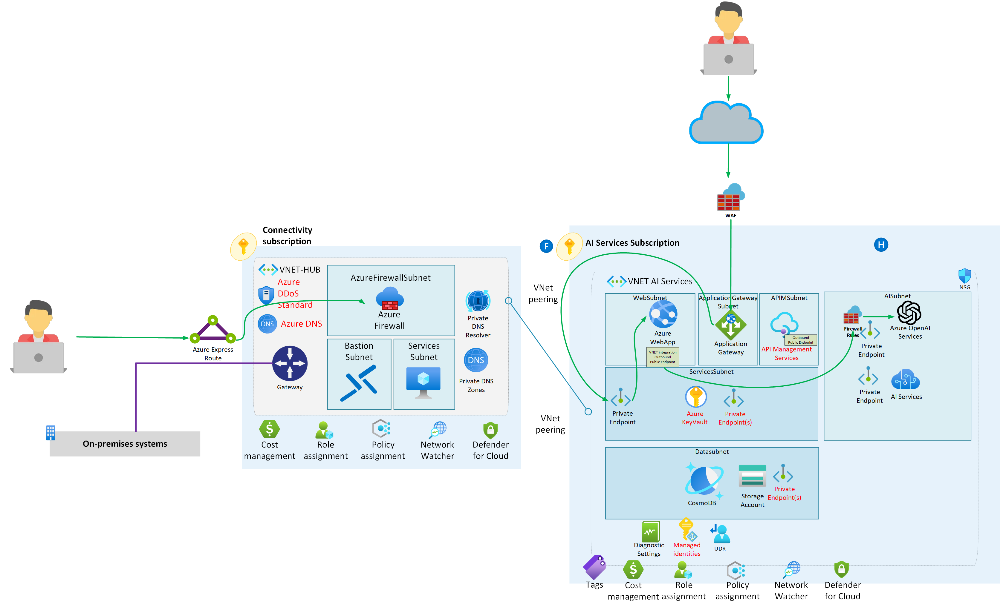

# Azure Landing Zones for OpenAI (works in progress)

## Scenario 1: Secure Communication to Azure App Service via Private Link

In this scenario, the user deploys the [Azure Landing Zone conceptual architecture](https://learn.microsoft.com/en-us/azure/cloud-adoption-framework/ready/landing-zone/#azure-landing-zone-architecture) to ensure a well-organized and secure Azure environment. The architecture includes the following components and steps:

- Azure Landing Zone: The deployment begins with setting up a standard Azure Landing Zone. This Landing Zone follows best practices and guidelines for organizing resources and aligning with security and compliance standards.

- Internal Network Access: Users can access an Azure App Service from within the internal network. To achieve this, a jumpbox or bastion host is used as an entry point to the Azure network. Users connect to the jumpbox securely, and from there, they can access other resources within the Azure network.

- Azure App Service with Private Link: The Azure App Service is configured to use a private link. This private link ensures that the web application is only accessible over a private network, enhancing security and minimizing exposure to the public internet.

- Azure OpenAI Integration: The web application deployed in the Azure App Service needs to connect to Azure OpenAI. To achieve secure communication, it uses a private endpoint for Azure OpenAI. Private endpoints allow services to be accessed privately within a virtual network, reducing exposure to the public internet.

- Firewall Rules for Azure OpenAI: Since the Azure App Service's outbound IP address is dynamic and public, it requires additional configuration on the Azure OpenAI side. Firewall rules are set up in Azure OpenAI to allow communication from the Azure App Service's dynamic IP address. This ensures that the web application can establish a secure connection with Azure OpenAI while maintaining a private and secure network architecture.

- Overall, this architecture scenario emphasizes security and isolation by utilizing private endpoints, restricting access to internal networks, and carefully managing communication between the Azure App Service and Azure OpenAI. It allows users to securely access the web application within the Azure network while ensuring that external connections are controlled and protected.

## Scenario 2: Securely Exposing the Application with Application Gateway and WAF

In this scenario, you build upon the architecture from the first scenario to securely expose your application to external users. The key components and steps are as follows:

- Azure Landing Zone: As in the previous scenario, you start with a standard Azure Landing Zone to ensure a well-organized and secure Azure environment.

- Internal Network Access via Jumpbox: Users can still access the Azure App Service from within the internal network through a jumpbox or bastion host, ensuring secure access to internal resources.

- Azure App Service with Private Link: Your Azure App Service continues to use a private link, maintaining a high level of security by allowing access only over a private network.

- Azure OpenAI Integration with Private Endpoint: The web application within the Azure App Service connects to Azure OpenAI via a private endpoint, ensuring secure and private communication.

- Application Gateway: In this scenario, you introduce an Azure Application Gateway. The Application Gateway acts as a reverse proxy, providing load balancing and traffic routing capabilities.

- Web Application Firewall (WAF): The Application Gateway is configured with a Web Application Firewall (WAF). The WAF provides security features such as protection against common web application attacks, like SQL injection and cross-site scripting (XSS) attacks. It helps safeguard your application against web-based threats.

- Securely Exposing the Application: The Application Gateway and WAF allow you to securely expose your web application to external users. Traffic from external users passes through the Application Gateway, which then routes it to the Azure App Service.

- Firewall Rules for Azure OpenAI: Similar to the first scenario, you maintain firewall rules in Azure OpenAI to allow communication from the dynamic IP address of the Azure App Service, ensuring secure access to Azure OpenAI resources.

This architecture enhances the security of your web application by adding a layer of protection through the Web Application Firewall (WAF) while still leveraging the benefits of private endpoints for Azure OpenAI. It provides a secure and controlled way to expose your application to external users while protecting it from common web-based threats.

## Scenario 3: Multi-Region Chatbot with Azure Front Door
